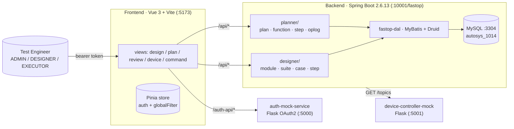

# Fastop · 航空检测工作流测试管理系统 / Aviation Inspection Test-Ops

> **Three-service, role-gated test-management platform: Vue 3 + Spring Boot (Maven multi-module) + a Flask OAuth2 mock, purpose-built for aircraft-inspection workflows.**
>
> 面向飞机检测工作流的测试管理平台：Vue 3 前端 + Spring Boot 多模块后端 + Flask OAuth2 鉴权 mock + 设备控制器 mock，三角色 RBAC 闭环，支持模块 / 用例 / 步骤 / 计划 / 执行全链路管理。

[English](#english) · [中文](#中文)


---

<a id="english"></a>

## TL;DR

Fastop is the backend + frontend of an aircraft-inspection test-management platform. It models the **design → plan → execute → review** lifecycle a test engineer goes through when qualifying avionics: reusable modules & steps, schedulable plans, real-time device control, signed-off reports. The repo ships a **Maven multi-module** Spring Boot backend, a **Vue 3 / Vite / TypeScript** frontend with Element Plus, plus two **Flask mocks** (OAuth2 + device controller) so the whole stack boots locally on a laptop without touching auth or hardware.

## Architecture · 架构



### Backend module layout

```
fastop/
├── fastop-base/       # Common utilities (fastop-base-common)
├── fastop-model/      # Entity / DTO
│   ├── fastop-model-designer/   # design-time entities
│   └── fastop-model-planner/    # runtime entities
├── fastop-dal/        # MyBatis mappers + XML (fastop-dal-designer)
└── fastop-service/    # Spring Boot app — controllers + services
```

The service layer is **domain-split**: `designer/` owns the reusable artifacts (modules, suites, cases, steps) and `planner/` owns execution (plans, functions, steps, op-logs). Each side follows `controller → service (interface) → service.impl`.

## Services at a glance

| Service | Port | Runtime | Purpose |
|---|---|---|---|
| `fastop/fastop-service` | `:10001/fastop` | Java 8 · Spring Boot 2.6.13 | REST APIs, MyBatis + Druid, OAuth2 resource server |
| `frontend` | `:5173` | Vue 3 · Vite · TS | Element-Plus UI, Pinia, Axios w/ bearer interceptor, proxy to `/api` + `/auth-api` |
| `auth-mock-service` | `:5000` | Python 3 · Flask | OAuth2 password-grant mock, in-memory tokens, 3 test users |
| `device-controller-mock` | `:5001` | Python 3 · Flask | Device-topic discovery + example payloads for command-step builder |

## Quickstart · 5 分钟跑起来

```bash
# 1. MySQL (any docker image works)
docker run -d --name fastop-mysql \
  -e MYSQL_ROOT_PASSWORD=root -e MYSQL_DATABASE=autosys_1014 \
  -p 3304:3306 mysql:8
# load schema / seed from fastop/dataset/

# 2. backend
cd fastop && mvn clean package -DskipTests \
  && java -jar fastop-service/target/fastop-service-*.jar

# 3. auth mock (separate terminal)
cd auth-mock-service && pip install -r requirements.txt && python app.py

# 4. device mock (optional, separate terminal)
cd device-controller-mock && pip install -r requirements.txt && python app.py

# 5. frontend
cd frontend && npm install && npm run dev
# open http://localhost:5173  →  admin / 123456
```

### Test accounts (auth mock)

| User | Password | Role |
|---|---|---|
| `admin` | `123456` | ADMIN |
| `designer1` | `123456` | DESIGNER |
| `worker1` | `123456` | EXECUTOR |

### API response envelope

```json
{ "code": 200, "data": {}, "message": "success", "timestamp": 1709423600 }
```

## Technical highlights · 技术亮点 (STAR)

<details>
<summary><b>🧩 Domain-split Maven multi-module</b> — designer vs. planner on one codebase</summary>

- **S**: Test-design artifacts (modules, cases, steps) and runtime-execution artifacts (plans, runs, op-logs) have almost no overlap in ownership but share user/role/auth.
- **A**: Split the service layer into `designer/` and `planner/` packages, each with its own `controller → service → impl → dal`. `fastop-model` and `fastop-dal` mirror the split (`fastop-model-designer`, `fastop-dal-designer`, etc.). `fastop-base` carries the cross-cutting concerns (response envelope, auth context, audit log).
- **R**: New features in one domain never touch the other's module. Future extraction into separate microservices is a rename, not a rewrite.
</details>

<details>
<summary><b>🛡️ RBAC + audit log with operation dependency tracking</b></summary>

Three roles (ADMIN / DESIGNER / EXECUTOR) enforced at the controller layer via Axios-propagated bearer tokens against the OAuth2 mock. The planner domain records every CRUD as an **op-log** row, plus a dependency graph so cancelling a parent plan cascades warnings to dependent functions/steps. The most recent commit explicitly enumerates: *"user context, dependency tracking, review permission check, state machine optimization, remark API split"*.
</details>

<details>
<summary><b>🧪 Local-first dev experience</b></summary>

No dev needs a shared auth IdP or a real device controller to contribute. Two Flask mocks (`auth-mock-service`, `device-controller-mock`) boot in one `pip install` and are wired through Vite's proxy. `.postman/` ships the full API lifecycle collection, and GitHub Actions Maven CI (`.github/workflows/maven.yml`) runs `mvn -B package -DskipTests` on Temurin JDK 8 for every PR touching `fastop/`.
</details>

<details>
<summary><b>🗃️ MyBatis XML + Druid</b> — classic Chinese-enterprise stack, done cleanly</summary>

Mapper XML lives in `fastop-service/src/main/resources/mapper/`, one file per entity. Druid pool exposes a monitor servlet for slow-query visibility. Schema + seed SQL lives in `fastop/dataset/` so a fresh MySQL instance is a single `source` away from a usable dev DB.
</details>

## Roadmap · 路线图

- [x] Maven multi-module separation, designer / planner domains
- [x] OAuth2 + RBAC end-to-end
- [x] Op-log with dependency tracking + state-machine review
- [x] Postman API lifecycle suite
- [ ] Swap MyBatis XML for MyBatis-Plus where CRUD is boilerplate
- [ ] Extract auth/device adapters behind Spring profiles so prod IdP & device bus drop in without code change
- [ ] Frontend: migrate from localStorage-token to HttpOnly cookie + CSRF token
- [ ] E2E tests: Cypress against the dev docker-compose

## Repo layout

```
zjuBackend/
├── fastop/                       # Spring Boot multi-module backend
│   ├── fastop-base/              #   shared utils + response envelope
│   ├── fastop-model/             #   designer + planner entities
│   ├── fastop-dal/               #   MyBatis mappers (+ XML)
│   ├── fastop-service/           #   controllers, services, main()
│   └── dataset/                  #   schema + seed SQL
├── frontend/                     # Vue 3 + Vite + TS + Element Plus
├── auth-mock-service/            # Flask OAuth2 password-grant mock
├── device-controller-mock/       # Flask device topic/payload mock
├── postman/                      # API lifecycle collection
├── .postman/                     # Postman workspace metadata
├── .github/workflows/maven.yml   # CI: mvn -B package on JDK 8
└── CLAUDE.md                     # deep architecture notes
```

<a id="中文"></a>

## 中文速读

- **做什么**：面向飞机检测场景的测试管理系统。覆盖「用例设计 → 测试计划 → 执行下发 → 审签复核」全链路，角色隔离（ADMIN / DESIGNER / EXECUTOR）。
- **技术栈**：Spring Boot 2.6.13 + Java 8 + MyBatis + Druid + MySQL（后端）；Vue 3 + Vite + TypeScript + Element Plus + Pinia（前端）；Flask OAuth2 与设备控制器 mock（本地联调）。
- **工程亮点**：
  - **领域拆分**：designer（设计态）/ planner（执行态）各有独立 controller/service/dal，后续抽微服务只需搬包；
  - **本地优先**：一条 `npm run dev` + 两条 `python app.py` 即可联通前端、后端、鉴权、设备 mock；
  - **审签依赖图**：最新一次提交实现了「用户上下文 / 依赖追踪 / 审签权限 / 状态机 / 备注接口拆分」，支撑复杂审批链；
  - **API 回包约定统一**：`{code,data,message,timestamp}`，前端用 Axios 拦截器做一次性错误分发。
- **CI**：GitHub Actions，改动命中 `fastop/` 即跑 `mvn -B package -DskipTests`。

## License

MIT © [Seal-Re](https://github.com/Seal-Re)
